# Wiki Explorer

Проект выполнен в рамках дисциплины **«Программирование на языке Python с использованием промптинга»**.

Тема проекта: **«Разработка CLI-утилит с использованием ИИ-инструментов»**.

## Описание проекта

Данный репозиторий содержит две версии CLI-утилиты для работы с Wikipedia через командную строку.

Цель проекта — разработать консольную Python-утилиту, которая позволяет получать, анализировать и визуализировать информацию из Wikipedia с использованием внешних API.

В рамках работы были подготовлены две реализации:

- `version_ChatGPT` — версия, разработанная с использованием ChatGPT;
- `version_DeepSeek` — версия, разработанная с использованием DeepSeek.

Обе версии решают одну и ту же задачу, но отличаются структурой, набором технических решений и подходом к реализации команд.

## Возможности CLI-утилиты

Утилита позволяет выполнять следующие действия:

- искать статьи Wikipedia по ключевым словам;
- получать основную информацию о статье;
- просматривать внутренние ссылки статьи;
- строить граф связей между статьями;
- получать категории статьи;
- просматривать статистику просмотров статьи;
- получать случайную статью;
- получать и скачивать изображения из статьи.

## Используемые API

В проекте используются публичные API Wikipedia/Wikimedia.

### MediaWiki Action API

MediaWiki Action API используется для получения основной информации из Wikipedia.

С его помощью реализованы команды:

- `search` — поиск статей;
- `info` — информация о статье;
- `links` — внутренние ссылки статьи;
- `graph` — получение ссылок для построения графа;
- `categories` — категории статьи;
- `random` — случайная статья;
- `images` — изображения статьи.

Базовый URL:

```text
https://{lang}.wikipedia.org/w/api.php
````

Где `{lang}` — код языка Wikipedia, например:

```text
ru
en
de
fr
```

### Wikimedia Pageviews API

Wikimedia Pageviews API используется для получения статистики просмотров статьи.

С его помощью реализована команда:

- `pageviews` — статистика просмотров статьи за выбранный период.
    

Базовый URL:

```text
https://wikimedia.org/api/rest_v1/metrics/pageviews/per-article/
```

## Структура репозитория

Общая структура проекта:

```text
wiki-explorer/
│
├── docs/
│   └── дополнительные материалы и документация
│
├── version_ChatGPT/
│   ├── wiki_explorer/
│   │   └── основной код CLI-утилиты версии ChatGPT
│   │
│   ├── tests/
│   │   └── тесты для версии ChatGPT
│   │
│   ├── main.py
│   ├── pyproject.toml
│   ├── pytest.ini
│   └── requirements.txt
│
├── version_DeepSeek/
│   ├── wiki_explorer/
│   │   └── основной код CLI-утилиты версии DeepSeek
│   │
│   ├── tests/
│   │   └── тесты для версии DeepSeek
│   │
│   └── setup.py
│
├── ТЗ_ChatGPT.md
├── ТЗ_DeepSeek.md
├── LICENSE
├── .gitignore
└── README.md
```

Папка `tests` находится не в корне репозитория, а внутри каждой версии проекта:

```text
version_ChatGPT/tests/
version_DeepSeek/tests/
```

Это сделано для того, чтобы тесты каждой реализации были отделены друг от друга и запускались независимо.

## Установка и использование

### 1. Клонирование репозитория

```bash
git clone https://github.com/dann1erel/wiki-exlorer.git
cd wiki-exlorer
```

---

## Установка версии ChatGPT

Перейдите в папку версии ChatGPT:

```bash
cd version_ChatGPT
```

Создайте виртуальное окружение:

```bash
python -m venv venv
```

Активируйте виртуальное окружение.

Для Windows:

```bash
venv\Scripts\activate
```

Для Linux/macOS:

```bash
source venv/bin/activate
```

Установите зависимости:

```bash
pip install -r requirements.txt
```

Установите проект в режиме разработки:

```bash
pip install -e .
```

Проверьте запуск CLI:

```bash
wiki-explorer-gpt --help
```

Пример использования:

```bash
wiki-explorer-gpt search "Python" --limit 10 --lang en
```

```bash
wiki-explorer-gpt info "Python" --show-categories --lang en
```

```bash
wiki-explorer-gpt pageviews "Python" --days 30 --chart ascii --lang en
```

---

## Установка версии DeepSeek

Из корня репозитория перейдите в папку версии DeepSeek:

```bash
cd version_DeepSeek
```

Создайте виртуальное окружение:

```bash
python -m venv venv
```

Активируйте виртуальное окружение.

Для Windows:

```bash
venv\Scripts\activate
```

Для Linux/macOS:

```bash
source venv/bin/activate
```

Установите проект в режиме разработки:

```bash
pip install -e .
```

Проверьте запуск CLI:

```bash
wiki-explorer-ds --help
```

Пример использования:

```bash
wiki-explorer-ds search "Python" --limit 10 --lang en
```

```bash
wiki-explorer-ds info "Python" --show-categories --lang en
```

```bash
wiki-explorer-ds pageviews "Python" --days 30 --chart ascii --lang en
```

## Основные команды

В обеих версиях реализован набор команд для работы с Wikipedia.

Примеры команд:

```bash
wiki-explorer-gpt search "искусственный интеллект" --limit 10
wiki-explorer-gpt info "Python" --show-categories
wiki-explorer-gpt links "Python" --limit 50
wiki-explorer-gpt graph "Python" --output graph.png
wiki-explorer-gpt categories "Python" --tree
wiki-explorer-gpt pageviews "Python" --days 30 --chart ascii
wiki-explorer-gpt random --with-image
wiki-explorer-gpt images "Солнечная система" --download --output ./pictures
```

Для версии DeepSeek используется другая команда запуска:

```bash
wiki-explorer-ds search "искусственный интеллект" --limit 10
wiki-explorer-ds info "Python" --show-categories
wiki-explorer-ds links "Python" --limit 50
wiki-explorer-ds graph "Python" --output graph.png
wiki-explorer-ds categories "Python" --tree
wiki-explorer-ds pageviews "Python" --days 30 --chart ascii
wiki-explorer-ds random --with-image
wiki-explorer-ds images "Солнечная система" --download --output ./pictures
```

## Сравнение подходов

В рамках проекта были разработаны две версии CLI-утилиты для работы с Wikipedia: версия, созданная с использованием ChatGPT, и версия, созданная с использованием DeepSeek. Обе реализации были выполнены по близкому техническому заданию и должны были поддерживать набор команд для поиска статей, получения информации, ссылок, категорий, статистики просмотров, изображений и построения графа связей.

Цель сравнения заключалась не только в проверке итогового кода, но и в анализе самого процесса разработки с помощью разных ИИ-инструментов: насколько точно модель следует техническому заданию, сохраняет контекст, исправляет ошибки, пишет тесты и помогает довести проект до рабочего состояния.

### Подход ChatGPT

Версия, разработанная с использованием ChatGPT, в целом показала более стабильный результат при работе с техническим заданием. Модель лучше удерживала общую структуру проекта, чаще учитывала уже реализованные команды и давала более связные инструкции по доработке проекта.

ChatGPT оказался удобнее при работе с несколькими файлами проекта и при последовательной разработке отдельных команд. В процессе разработки было проще возвращаться к уже обсуждённым решениям, уточнять архитектуру и исправлять ошибки сразу в нескольких связанных местах.

При этом версия ChatGPT также не была полностью безошибочной. В процессе разработки возникали отдельные технические проблемы, например необходимость корректно указывать `User-Agent` при обращении к API Wikipedia/Wikimedia. Также некоторые требования приходилось уточнять дополнительно, например параметры команд, работу с глубиной графа и соответствие примеров использования фактическим сигнатурам команд.

**Преимущества подхода ChatGPT:**

- лучшее сохранение контекста проекта;
- более удобная работа с несколькими файлами и архивами кода;
- более последовательная помощь при разработке команд;
- меньше мелких синтаксических и логических ошибок;
- удобнее исправлять одну ошибку сразу в нескольких местах проекта;
- лучше подходит для итерационной доработки учебного проекта.

**Недостатки подхода ChatGPT:**

- отдельные технические ошибки всё равно возникали;
- некоторые требования ТЗ приходилось дополнительно уточнять;
- не все примеры использования сразу полностью соответствовали итоговой реализации;

### Подход DeepSeek

Версия, разработанная с использованием DeepSeek, также позволила получить рабочую основу проекта, однако процесс разработки оказался менее стабильным. В ходе работы чаще возникали мелкие ошибки в коде, несоответствия техническому заданию и проблемы с сохранением контекста.

Одной из заметных проблем было то, что DeepSeek мог предложить использовать параметр или файл, которого фактически не было в проекте. Например, модель ссылалась на несуществующий файл `wiki_explorer/utils/output.py`, хотя такой файл отсутствовал в структуре проекта. Также встречались ошибки в сигнатурах команд, неверный порядок параметров, некорректные примеры использования и несоответствие параметра `--verbose` требованиям ТЗ.

Отдельные трудности возникли с тестированием. DeepSeek не сразу учёл необходимость тестов, а после их добавления тесты не запускались с первого раза из-за отсутствия файла с настройками. Также возникали мелкие, но показательные ошибки: различие между Windows- и Unix-путями (`\` и `/`), несовпадение языка по умолчанию в коде и тестах, использование `List` вместо `list`, неправильные импорты и неверные параметры для API Wikipedia.

Кроме того, DeepSeek хуже справлялся с исправлением одной и той же ошибки сразу в нескольких местах. Часто требовалось больше итераций: сначала исправлялась одна часть проекта, затем обнаруживалась похожая ошибка в другом файле. Также модель иногда теряла контекст и предлагала реализовать команды, которые уже были созданы ранее.

При этом у DeepSeek были и положительные стороны. Он работал быстрее, а также позволял видеть ход рассуждений модели, что помогало понимать, почему она предлагает то или иное решение. Это было полезно при анализе подхода, но не всегда приводило к более качественному итоговому коду.

**Преимущества подхода DeepSeek:**

- высокая скорость генерации ответов;
- возможность видеть ход рассуждений модели;
- быстрое создание первоначального варианта кода;
- полезен для получения черновых решений и альтернативных идей.

**Недостатки подхода DeepSeek:**

- больше мелких ошибок в коде;
- чаще встречались несоответствия техническому заданию;
- хуже сохранялся контекст проекта;
- модель могла ссылаться на несуществующие файлы;
- тесты потребовали дополнительных исправлений;
- возникали ошибки в параметрах API и сигнатурах команд;
- сложнее исправлять одну ошибку сразу во всём проекте;
- не было возможности удобно передавать ZIP-архив с кодом.

### Итоговое сравнение

| Критерий | Версия ChatGPT | Версия DeepSeek |
|---|---|---|
| Следование ТЗ | В целом лучше соблюдает требования, но отдельные параметры требовали уточнения | Чаще возникали расхождения с ТЗ и некорректные примеры |
| Сохранение контекста | Лучше удерживает структуру проекта и уже реализованные команды | Иногда теряет контекст и предлагает повторно реализовать уже существующие части |
| Работа с файлами | Удобнее работать с несколькими файлами и архивами проекта | Менее удобно работать с полным проектом, особенно с архивами |
| Качество кода | Меньше мелких синтаксических и логических ошибок | Больше мелких ошибок: неверные импорты, типы, параметры API |
| Исправление ошибок | Проще исправлять проблему сразу в нескольких связанных местах | Часто требовалось больше итераций для исправления похожих ошибок |
| Тестирование | Тесты проще было довести до рабочего состояния | Тесты не запустились с первого раза, потребовались дополнительные настройки |
| Скорость работы | Ответы более подробные, но иногда медленнее | Работает быстрее |
| Объяснение решений | Даёт связные пояснения и инструкции | Можно видеть ход рассуждений, что полезно для анализа |
| Общее впечатление | Более надёжный инструмент для последовательной разработки учебного проекта | Полезен для быстрых черновиков, но требует более внимательной проверки |

### Вывод

По итогам разработки можно сделать вывод, что ChatGPT оказался более удобным инструментом для последовательной реализации CLI-утилиты по техническому заданию. Он лучше сохранял контекст, аккуратнее работал со структурой проекта и реже допускал мелкие ошибки, влияющие на запуск программы и тестов.

DeepSeek оказался полезен как быстрый инструмент для генерации первоначальных решений и альтернативных идей, однако итоговый код требовал более тщательной проверки. Основные сложности были связаны с потерей контекста, несоответствием отдельных решений техническому заданию, ошибками в параметрах API и необходимостью большего количества итераций при исправлении багов.

Таким образом, для данного проекта ChatGPT показал себя более подходящим инструментом для доведения учебной CLI-утилиты до рабочего состояния, а DeepSeek — как быстрый, но менее стабильный помощник, результаты которого требуют более внимательной ручной проверки.
## Скриншоты работы

### Справка CLI

Версия ChatGPT:

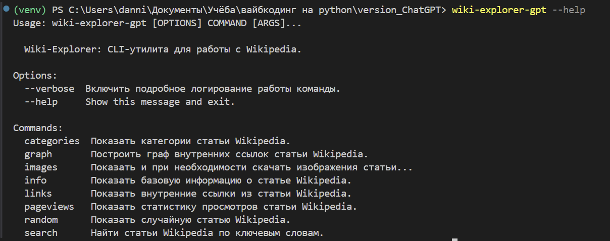

Версия DeepSeek:

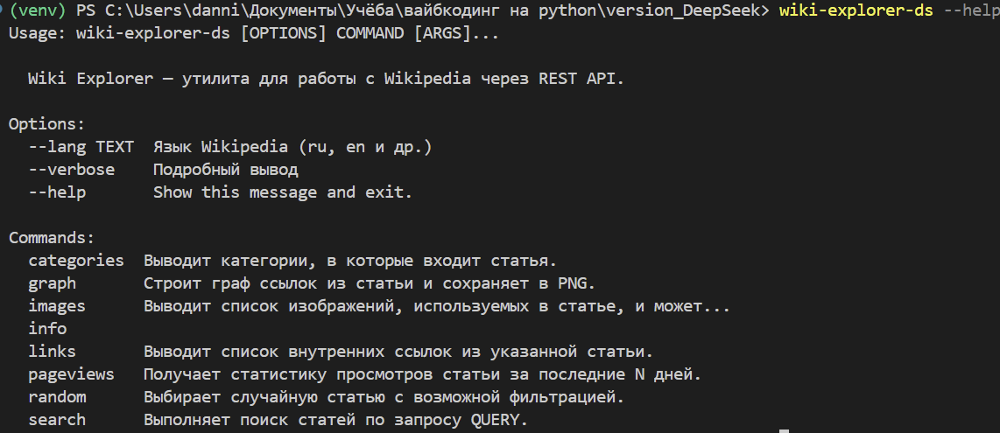

### Команда search

Версия ChatGPT:
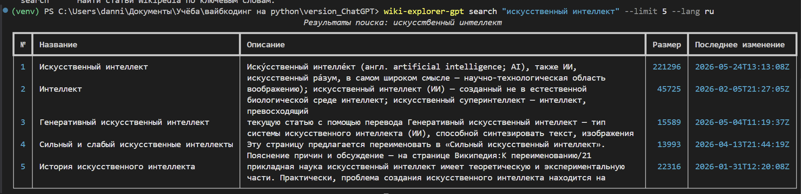

Версия DeepSeek:
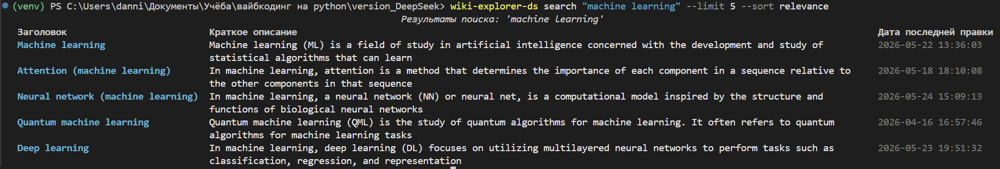

### Команда info

Версия ChatGPT:
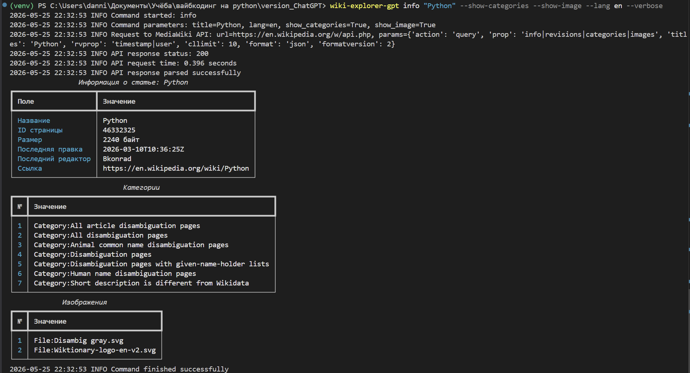

Версия DeepSeek:
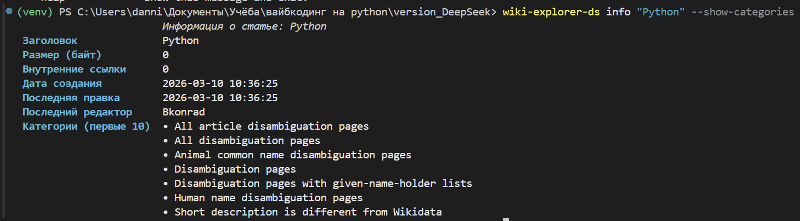

### Команда links

Версия ChatGPT:
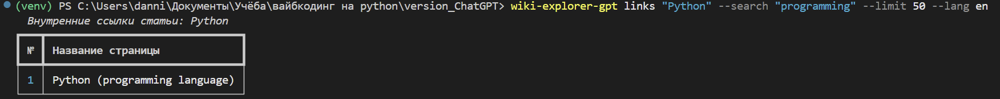

Версия DeepSeek:
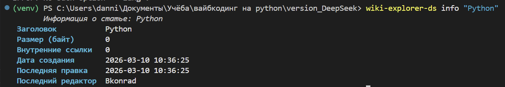

### Команда graph

Версия ChatGPT:
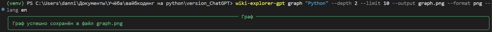

Получившийся граф:
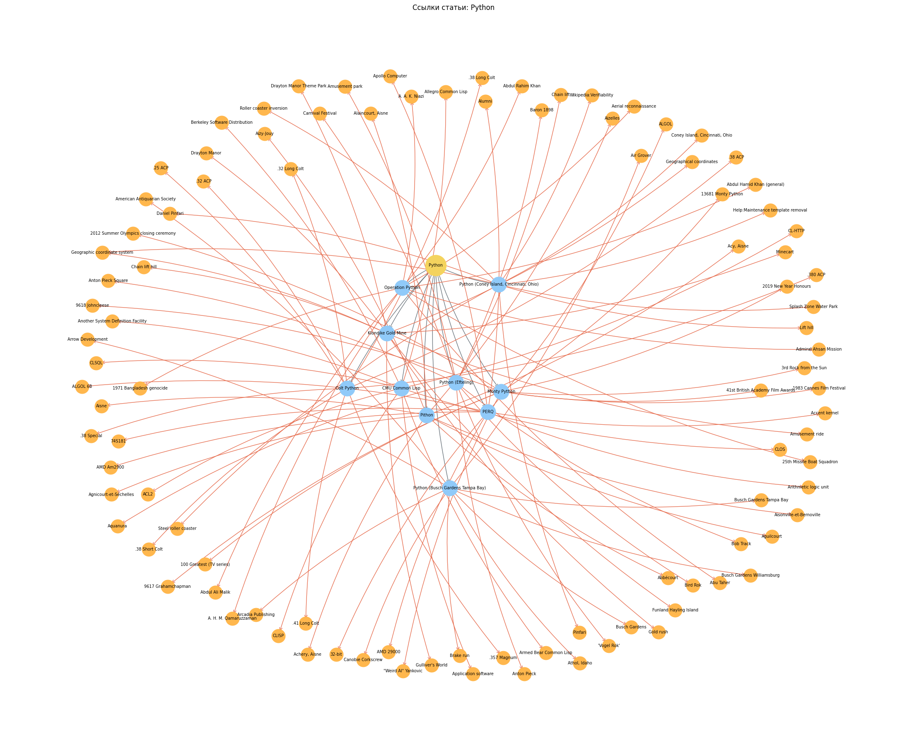

Версия DeepSeek:
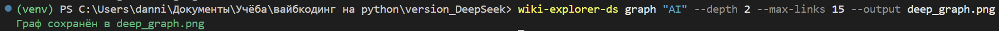

Получившийся граф:
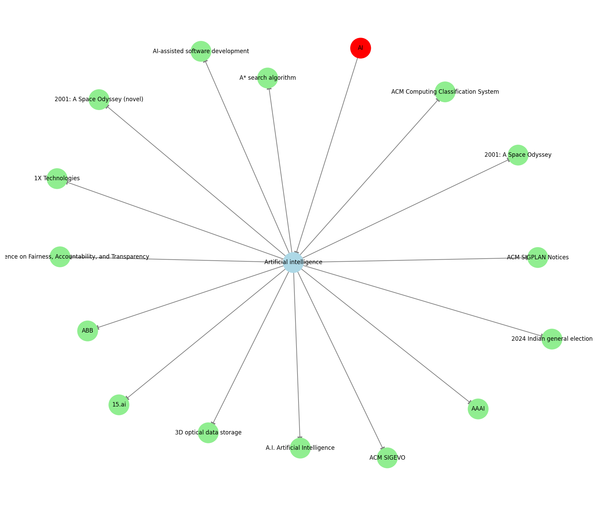

### Команда categories

Версия ChatGPT:
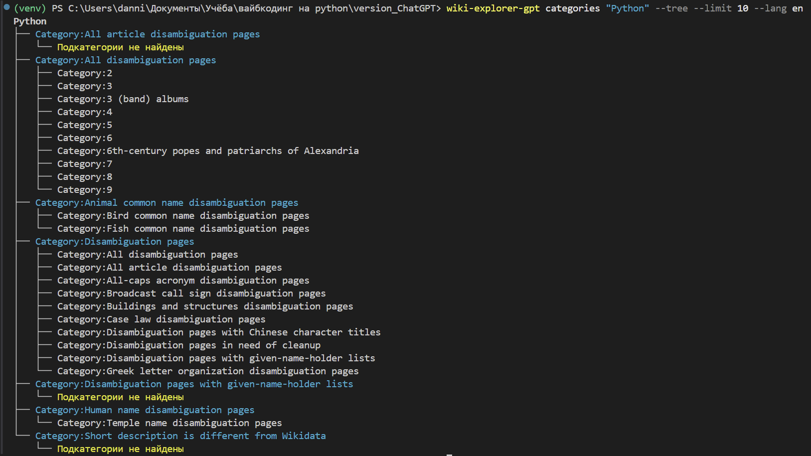

Версия DeepSeek:
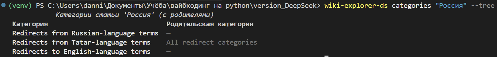

### Команда pageviews

Версия ChatGPT:
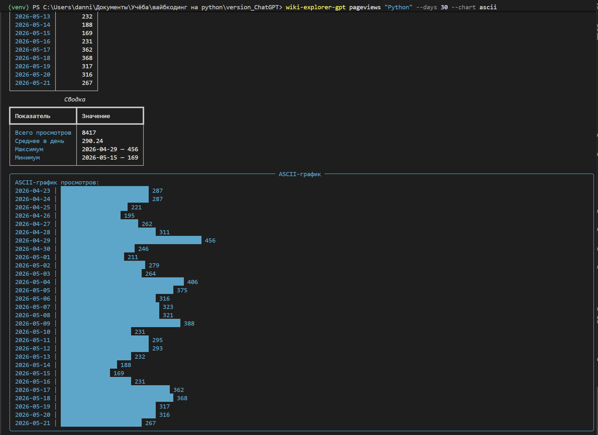

Версия DeepSeek:
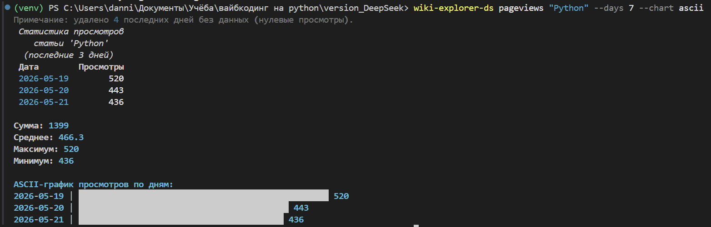

### Команда random

Версия ChatGPT:
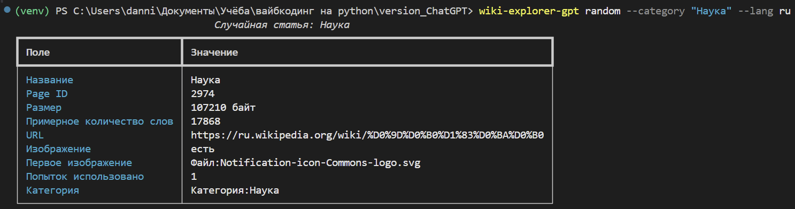

Версия DeepSeek:
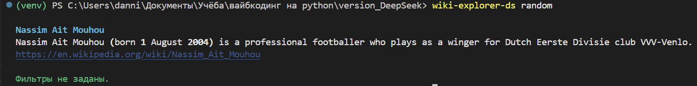

### Команда images

Версия ChatGPT:
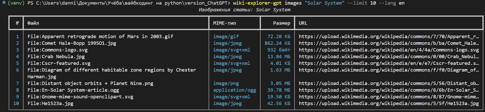

Версия DeepSeek:
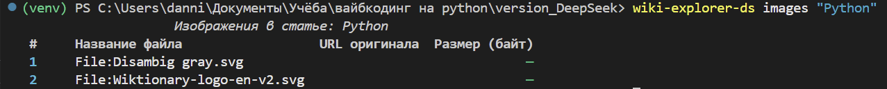

## Инструкция по тестированию

Тесты находятся внутри каждой версии проекта.

### Тестирование версии ChatGPT

Перейдите в папку версии ChatGPT:

```bash
cd version_ChatGPT
```

Активируйте виртуальное окружение:

```bash
venv\Scripts\activate
```

Для Linux/macOS:

```bash
source venv/bin/activate
```

Установите зависимости:

```bash
pip install -r requirements.txt
pip install -e .
```

Запустите тесты:

```bash
pytest
```

Если установлен `pytest-cov`, можно проверить покрытие:

```bash
pytest --cov=wiki_explorer
```

### Тестирование версии DeepSeek

Перейдите в папку версии DeepSeek:

```bash
cd version_DeepSeek
```

Активируйте виртуальное окружение:

```bash
venv\Scripts\activate
```

Для Linux/macOS:

```bash
source venv/bin/activate
```

Установите проект:

```bash
pip install -e .
```

Запустите тесты:

```bash
pytest
```

Если установлен `pytest-cov`, можно проверить покрытие:

```bash
pytest --cov=wiki_explorer
```

## Используемые технологии

В проекте используются:

- Python;
    
- Click;
    
- Requests;
    
- Rich;
    
- NetworkX;
    
- Matplotlib;
    
- Pytest;
    
- MediaWiki Action API;
    
- Wikimedia Pageviews API.
    

## Лицензия

Проект распространяется под лицензией MIT.

```

Я бы ещё добавил в корень папку `docs/screenshots/`, чтобы ссылки на картинки из README потом сразу работали.
::contentReference[oaicite:3]{index=3}
```